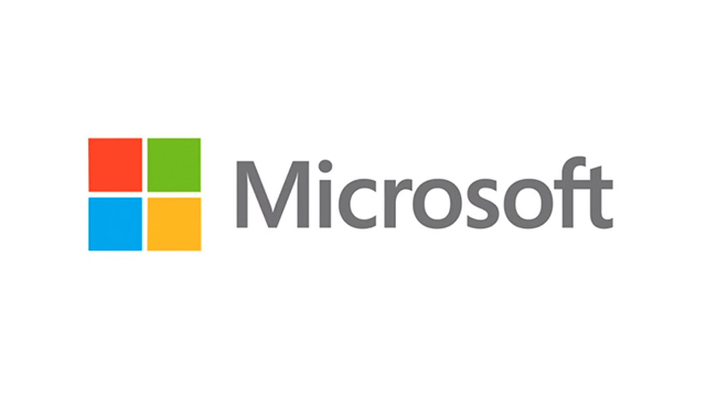

# On my time as a “Virtual” Intern at MSFT

Okay. 

..... okay.  

I am going to explain, right now, why a work from home internship I did at Microsoft India during Corona-Quarantine times has been one of the single best and most important experiences of my life as an aspiring SDE.  

This isn’t the first time I have tried. There are a half-dozen half-finished Word documents on my laptop, all of them abandoned at some point because I felt like I was failing to express myself. I mean, there’s a lot at stake here. My devotion to the company and what it represents has been such that, despite being a huge linux advocate for most of my coding life, I found myself shifting to everything Microsoft, from browser to IDE to Dev environment, in the last 8 weeks. I have witnessed (in a very virtual first hand fashion) MS software design philosophy, have interacted with its global workforce and experienced its culture. I have seen the massive organisational wheel in action, and witnessed how every single employee plays a part in the system, a system where despite being an intern, you can make a tangible impact with just a laptop and some passion.  

But enough is enough. The more I procrastinate about writing this, the hazier my memory will be and the less I’ll do the experience justice. So here I go.
This article will be in three parts. Which is a bit pretentious, but it can’t be helped, for it’s the only way to show you what this experience showed me.

You ready? I’m not ready. Okay let’s do this.  

## Part 1: The Beginning

On the morning of 11th May, I received a call from Microsoft to help me set everything up and get started with my internship. Though I didn’t know it at the time, it was my first call with my Manager, Lalit Vohra sir. I had no idea about my location or team either at that moment, but it was all too exciting and I immediately got to it. The first thing I noticed was how prepared MS had been with everything to provide us with a smooth virtual onboarding experience. The VMs were running smoothly, all the information on how to access all internal tools were given to us by the HR and by the end of the day, after realise all the cool things I could access with my @microsoft id, I felt like a part of the organisation already.  

It was thrilling, meeting my team and co-interns for the first time. I was introduced to my team by my manager, who encouraged us to attend the daily Scrum meetings to promote inclusion from the first week itself. This was one of the best things one could have done in a virtual setting to promote inclusivity and hearing about work updates and design discussions everyday gave me a better idea of what being a SDE at Microsoft is all about. 

Finally, I had a meeting with my mentor, Rajat Agarwal, who came off as a little intimidating at the start. He was very proficient in Javascript and used to hold quizzes on teams for everyone for the same, plus he had loads of experience in the industry. I realised how wrong my first impression was from the second interaction itself after we discussed my project: He was very excited about the project, decided roadmaps for the progress and encouraged me to share my ideas too. He created a very open environment where I could express myself freely right from the start. I did have some reservations about the project at the start – it had intelligence and machine learning components I wanted but was essentially a client side feature addition. I spoke to Lalit sir about this issue, who advised me to give it a shot and not be intimidated at the prospect of learning something new – even if it doesn’t seem exciting at first – because that’s what the industry is all about. Retrospectively, I wish someone had told me this a lot sooner – I had formed this amazing idea in my head that being a dev was all about identifying a skill you like and want to pursue and mastering it. And in my last 8 weeks at MS, I have realised that its more about working with new technologies and big codebases you know nothing about, understanding it and making a tangible impact and getting your work done nonetheless – as quickly as possible. Its about learning to learn and doing so efficiently. That, for me, will be my biggest takeaway from this experience.  

## Part 2: The Journey

Having milestones every week was interesting. It didn’t feel like working against a deadline, since I actually started caring enough about the feature I was adding that I wanted everything to be perfect. In my second week itself, I started leading discussions and making decisions that would affect what the feature would look like in the future. I talked to loads of people at Microsoft, I talked to design team to help me design the feature better, the engineering team who gave me very helpful suggestions whenever I faced difficulties and my own team, who kept giving their invaluable feedback to make the feature better. I realised what it was like to work with a truly global team – whenever I needed to spend time with someone from the US or Canada team, I used to stay up until midnight to make sure I contacted them when it was convenient and got the work done, so as to utilize the next day efficiently and without blockers. This affected my sleep schedule but I was learning a lot everyday and it was a very fulfilling experience, talking to global Microsoft Developers and being able to understand and implement their suggestions.   

The autonomy Lalit and Rajat sir provided me with truly helped me learn and grow during this period. Since WFH involves only you and your laptop at most times, it also taught me how to unblock myself whenever something went wrong. In my fifth week, my Blue Chicken environment broke down when I merged it with master to fix a GVFS issue, and I was left with no clues how to move forward. I reached out to the WAC team for help, and in the meantime promptly started working with Kusto to analyse user data and behaviour statistics and understand the need for this feature better. 

Our main milestones, which we had discussed on my first week, were finished in my sixth week at Microsoft, when we finally integrated Dave’s model and made everything work. I still remember how I felt at that moment, I was so excited I dragged my parents in front of the laptop and showed them what I had created while simultaneously trying to get them to appreciate how much effort went behind every small thing. Looking back, the one single thing that proved a challenge again and again was the fact that much of the OOUI codebase was undocumented. You wanted to get anything done, you had to ask. And I am extremely grateful to the members of my team in that regard – they truly made sure that even in a virtual setting, I got all the help I needed to get what I had to done. The team spirit most people in the org have is truly inspiring.   

## Part 3: The End

With our main deliverables achieved and running, I spent the next two weeks refactoring my code and trying to get my PR approved, making incremental updates to the feature and documenting the entire feature in a compact spec sheet. I also gave a demo of the feature to the WAVE team who appreciated the feature a lot. At the same time, I started learning how to be more confident about my ideas, especially in front of others. I used to be more reserved about my ideas at the start and often looked for approvals from m y superiors even when I knew what exactly was to be done, something Lalit sir realised and advised me about. I feel I have definitely gotten better at being more assertive in this area.  

As I wrap everything up and enter my final week as an intern at  MSFT, can’t help but wonder what my vacations would have looked like if, like most other companies, Microsoft had decided to cancel or shorten our internship periods. It will be equally weird to open wake up and open my laptop to 8 teams chats and 20+ emails on outlook. I had quickly learnt that this was a place that offered endless opportunities to a young intern, far more than I had earned. I've learnt a lot in my time here - and that goes well beyond just coding. A lot of people already know what a great company Microsoft is, but they probably don't know how great the people here are at making a new coder like me feel like a fully initiated part of a team.  

My friend told me today he started using Word Online last week for his term paper and would never go back to other text editors. Whenever I hear something like this, I will always be proud to have worked here, with the team that developed these apps. I will genuinely miss it.  
